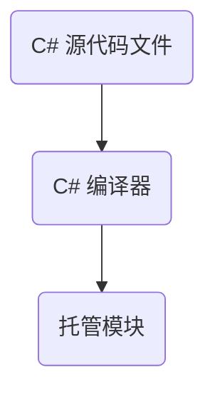

# C# CLR
## CLR的执行模式
### CLR简介及托管模块
**CLR 公共语言运行时（Common Language Runtime ,CLR）** 核心功能为

- 内存管理
- 程序集加载
- 安全性
- 异常处理和线程同步

CLR和语言无关，只要编辑器是面向CLR的。编译器可视为语法检查器和“正确代码”分析器。微软创建了好几个面向CLR的语言编辑器：C++/CLI，C#，VB，以及一个中间语言**IL**汇编器。

使用支持CLR的任何语言创建大妈文件，然后用对应的编辑器检查语法和分析源代码。无论用哪个编译器，最后的编译结果都是**托管模块**。

**托管模块**是Win可移植执行体文件，PE32或者PE32+，它们都需要CLR才能执行。托管程序集总是利用Windows的数据执行保护和地址空间布局随机化，这两个功能旨在增强整个系统的随机性。



**托管模块**

- PE32或者PE32+头

  标准的Windows PE文件头。PE32则可以在32或者64位上跑。32+则只能正在64位上跑。

- CLR头

  包含使这个模块成为托管模块的信息。

- 元数据

  每个托管模块都包含元数据表。元数据主要有两种表：

  - 描述源代码中定义的类型和成员
  - 描述源代码中引用的类型和成员

  除此之外，元数据还有以下用途

  - 避免代码编译时对原生C/C++头和库文件的需求，因为在实现类型/成员的IL代码文件中，已经包含有关引用类型/成员的全部信息。编译器直接从托管模块读取元数据。
  - VS用元数据帮助开发者写代码。IntelliSense技术会解析元数据，告诉开发者一个类型提供了哪些方法，属性，事件和字段。
  - CLR的代码验证过程使用元数据确保代码只执行“类型安全”的操作
  - 元数据允许将对象的字段序列化到内存块，将其发送给另一台机器，然后反序列化，在远程机器上重建对象状态。
  - 元数据允许垃圾回收器跟踪对象的生存期。

- IL（中间语言代码）

  编译器编译源代码生成的代码。在运行时，CLR将IL编译成本机CPU指令。

本机代码编译器生成的是面向特定CPU架构的代码，相反每个面向CLR的编译器生成的都是IL代码（跨平台性更好）。所以IL代码有时被称为托管代码，因为CLR管理它的执行。
### 托管模块合并成程序集

CLR实际不和模块工作，它和程序集工作。**程序集**是一个或者多个模块/资源文件的逻辑性分组。其次，程序集是重用，安全性以及版本控制的最小单元。

利用程序集，一组文件可以作为一个单独的实体来对待。如下图:


托管模块和资源文件交由一个工具处理。工具生成代表文件逻辑分组的一个PE32+文件。这个PE32+文件包含一个名为清单的数据块。清单也是元数据表的集合。这些表描述了构成程序集的文件，程序集中定义的public类型以及程序集关联的资源或者数据文件。

C#编译器生成的是含有清单的托管模块。清单指出程序集只由一个文件构成。所以，对于只有一个托管模块且无资源（数据）文件的项目，程序集就是托管模块，生成过程无需执行任何额外的步骤。如果希望将一组文件合并到程序集，就必须借助工具（程序集连接器，AL.exe）及其命令行选项。

### 加载公共语言运行时

生成的每个程序集既可以是可执行应用程序，也可以是DLL。最终是由CLR管理这些程序集中的代码。所以目标机器必须安装好.NET Framework。

检查%SystemRoot%\System32 目录中的MSCorEE.dll文件，如果文件存在，则已经安装了.Net 环境。

.Net Framework SDK提供了名为 CLRVer.exe 的命令行实用程序，能够列出机器上安装的所有CLR版本。还能列出机器中正在运行的进程使用的CLR版本号。

### 执行程序集代码

> IL是与CPU无关的机器语言，可以将其视为一种面向对象的机器语言。开发人员使用C#或者其他语言编程，它们的编译器将生成IL。高级语言通常只公开了CLR全部功能的一个子集。然而IL汇编语言可以访问CLR的全部功能。所以，如果选择的编程语言隐藏了你迫切需要的一个CLR功能时，你可以换用IL汇编语言或者提供了所需功能的另一种语言来编写那部分代码。

------

为了执行方法,首先必须把方法的IL转换成本机CPU指令。这是CLR的JIT编辑器的职责。


在Main执行前，CLR会检测出Main的代码引用的所有类型。这导致CLR分配一个内部数据结构来管理对引用类型的访问。如上图Main引用了Console类型，导致CLR分配一个内部结构，在这个内部数据结构中，Console类型定义的每个方法都有一个对应的记录项。每个记录项都含有一个地址，根据此地址可以找到方法的实现。

对这个结构初始化时，CLR将每个记录项都设置成包含在CLR内部的一个未编档的函数成为**JITCompiler**。

看一下刚才那个简单的函数怎么执行的

- **Main**方法首次调用**WriteLine**时，**JITCompiler**函数负责将方法的IL代码编译成本机的CPU指令。
- **JITCompiler**函数被调用时，它知道要调用的是哪个方法，以及具体是什么类型定义了该方法。然后，JITCompiler会在定义该类型的程序集的元数据中查找被调用方法的**IL**。接着JITCompiler验证IL代码，并将IL代码编译成本机CPU指令。这个指令会被保存到动态分类的内存块中。然后，JITCompiler回到CLR为类型创建的内部数据结构，找到与被调用方法对应的那条记录，修改引用地址，使其指向包含那个方法的地址。最后，JITCompiler函数跳转到内存块中的代码，这些代码正是**WriteLine**方法的具体实现。代码执行完毕后返回带Main中的代码。
- 第二次调用这个方法时，因为该方法已经保存在内存中了，会直接执行，跳过第二步。

### 本机代码生成器:NGen.exe

使用.NET提供的NGen.exe 工具，可以在应用程序安装到用户的计算机上时，将IL代码编译成本机代码。由于代码在安装时已经编译好，所以JIT不需要在运行时编译IL代码，有助于提高程序运行速度。

NGen.exe能在以下两种情况下发挥重要作用

- 提高程序的启动速度

  因为代码已经编译成本机代码，运行时不需要再花费时间编译。

- 减少应用程序的工作集。

  如果一个程序集同时加载到多个进程，对该程序集运行NGen.exe可以减少应用程序的工作及。因为被编译成了本机代码，并且将这些代码保存到单独的文件中。该文件可以通过“内存映射”的方式同时映射到多个进程的地址空间中，使代码得到了共享。避免每个进程都拷贝一份

### 通用类型系统

CLR一切都围绕类型展开。类型可以使一种编程语言编写的代码与另一种编程语言写的代码沟通。微软制定了一个正式的规范来描述类型的定义和行为，这就是“通用类型系统”**CTS**

**CTS**规范规定，一个类型可以包含零个或者多个成员。

- 字段Field

  作为对象状态一部分的数据变量。字段根据名称和类型来区分。

- 方法Method

  针对对象执行操作的函数

- 属性Property

- 事件Event

  事件在对象以及其他相关对象之间实现了通知机制。

**CTS**还定义了类型可见性规则及类型成员的访问规则

- private

  只能由同一个类中的其他成员访问 

- family

  成员可由派生类型访问，不管是否在同一个程序集，C++和C#都用protected来标识family

- family and assembly

  同一个程序集中的派生类可以访问，c#没有定义

- assembly

  成员可由同一个程序集中的任何代码访问，C#用Internal修饰符来表示

- family or assembly

- public

  任何程序集中的任何代码访问。

区别对待“代码的语言”和“代码的行为”。使用C++可以定义自己的类型，C#也可以定义自己的类型。这些类型都有自己的成员。使用不同的语言，定义类型的语法也不同。但是，无论使用哪一种语言，类型的行为都完全一致，因为最终是由CLR的CTS来定义类型的行为。如下例子:

CTS规定一个类型只能从一个基类派生（单继承），但是C++允许多继承，所以使用基于CLR的编译器编译多继承的C++就会报错。

另一条CTS规则:所有的类型最终必须从System.Object类型继承。Object允许做下面这些事情

- 比较两个实例的相等性
- 获取实例的哈希码
- 查询一个实例的真正类型
- 执行实例的浅拷贝
- 获取实例对象当前状态的字符串表示

### 公共语言规范

CLR使用标准类型集，元数据以及公共执行环境可以使一种语言创建的对象在另一种语言中使用。

各种编程语言存在极大区别。例如，有的语言不区分大小写，有的不支持unsigned整数，操作符重载或者参数变量可变的方法等。要创建很容易从其他编程语言中访问的类型，只能从自己的语言中挑选其他语言都支持的功能。为此，微软定义了公共语言规范**CLS**，它详细定义了一个最小功能集。任何编译器只有支持这个功能集，生成的类型才能兼容由其他符合CLS，面向CLR语言生成的组件。

### 与非托管代码的互操作性

CLR支持三种互操作情形

- 托管代码能调用DLL中的非托管代码
- 托管代码可以使用现有的COM组件
- 非托管代码可以使用托管类型

## 生成，打包，部署和管理应用程序类型

### 将类型生成到模块中

```c#
public sealed class Program
{
    public static void Main()
    {
        System.Console.WriteLine("Hi");
    }
}
```

这个应用程序声明了一个**Program**类，其中有名为**Main**的**public static**方法。**Main**中引用了另一个类型的**System.Console**。**System.Console**是微软实现好的类，用于实现这个类的IL代码存储在**MSCorLib.dll**文件中。

使用命令行编译该代码

```
csc.exe /out:Program.exe /t:exe /r:MSCorLib.dll Program.cs
```

该命令行指示C#编译器生成名为Program.exe的可执行文件。文件类型是Win32控制台应用程序类型。

r:MSCorLib.ll是告诉编译器，该程序引用了外部DLL的方法，需要去链接这个dll。

生成的Programe.exe是什么呢？

它是标准**PE**（可移植执行体）文件。这意味着运行32位或64位**Windows**的计算机能加载它

### 元数据概述

Programe.exe我们知道了是PE文件，但是该文件中有些什么呢？

托管PE文件由四部分构成：**PE32(+)**头，**CLR**头，元数据及**IL**。

- **PE32（+）头**是Windows要求的标准信息
- **CLR**是一个小的信息块，是需要CLR的模块特有的。这个头包含模块生成时所面向的**CLR**的major和minor版本号。一些标志；一个**MethodDEF** token，该token指定了模块的入口方法；一个可选的强名称数字签名。最后**CLR**头还包含内部模块的一些元数据表的大小和偏移量。
- 元数据是由几个表构成的二进制数据块。有三种表，分别是定义表，引用表，和清单表。


可用多种工具检查托管PE文件中的元数据。如**ILDasm.exe**。即**IL Disassembler**反汇编器。要查看元数据表执行以下命令

```
ILDasm Program.exe
```


### 模块合并成程序集

**Program.exe**除了是一个含有元数据的PE文件，它还是一个**程序集**。

程序集是一个或者多个类型定义文件及资源文件的集合。在程序集的所有文件中，有一个文件容纳了**清单**。清单也是一个元数据表集合。

**CLR**操作的是程序集，它总是首先加载包含**清单**元数据表的文件，再根据“清单”来获取程序集中其他文件的总称。以下是程序集的重要特点

- 程序集定义了可重用的类型
- 程序集用一个版本号标记
- 程序集可以关联安全信息

除了包含清单元数据表的文件，程序集其他单独的文件并不具备上述特点。可以将程序集看作一个逻辑**EXE**或者**DLL**

生成程序集要么选择现有的PE文件作为清单的宿主，要么创建单独的PE文件并且只在其中包含清单。

> 关于程序集，还有很多东西。看不完了PS：现在先不看

## 基础类型

### 所有类型都从System.Object派生

~~~C#
//隐式派生
class Employee
{
	```````
}
//显式派生
class Employee : System.Object
{
	`````````
}
~~~

上述代码的两个是等价的。由于所有类都从Object派生，所以每个类型的每个对象都保证了一组最基本的方法。

| 方法        | 描述 |
| :---------- | ---- |
| Equals      | 如果两个对象具有相同的值返回Ture |
| GetHashCode | 返回对象的Hash值。如果某个对象要作为哈希表的值，应该重写该方法 |
| ToString    | 默认返回类型的完整名称 |
| GetType     | 返回从Type派生的一个实例的类型，指出调用GetType的那个对象是什么类型 |
| MemberwiseClone | 创建类型的新实例，并将新对象的实例字段设与this对象的实例字段完全一致 |
| Finalize |再GC判断对象应该作为垃圾被回收后，在对象的内存被实际回收之前，会调用这个方法。|

**CLR**要求所有对象都用new 操作符创建。以下是new操作符所作的事情:

- 计算类型及其所有基类型中定义的所有实例字段所需要的字节数。堆上每个对象都系要一些额外的成员，包括“类型对象指针”和“同步索引块”。CLR利用这些成员管理对象。额外的成员的字节数要计入对象大小
- 从托管堆中分配类型要求的字节数，从而分配对象的内存。
- 初始化对象的“类型对象指针”系欸“同步块索引”成员
- 调用类型的实例构造器，传递在new调用中指定的实参。

new 执行了这些所有操作后，返回指向新建对象的一个引用（或指针）。By the way 没有与new对应的delete操作符，CLR机制下，不能显示释放对象的内存。

### 类型转换

**is**和**as**操作符。

```C#
bool a = o is A;
if(a)
{
   A b = (A)o;
}
//上述检查两次类型
A b = o as A;
//上述代码检查一次，如果是A类型就返回A类型的引用，如果不是返回null；
```

### 运行时的相互关系


一张图解释清楚运行时的关系。
