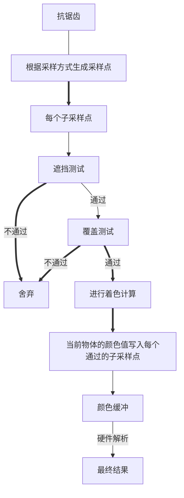

# 主流抗锯齿方案

## 锯齿产生的原因
> 锯齿的来源是因为场景的定义在三维空间中是连续的，而最终显示的像素则是一个离散的二维数组。所以判断一个点到底没有被某个像素覆盖的时候单纯是一个“有”或者“没有"问题，丢失了连续性的信息，导致锯齿。从信号角度来说，就是采样的频率跟不上信号变化的频率。所以最有效的解决方法就是增加采样频率，实时渲染中的抗锯齿基本为先模糊再采样的操作     

光栅化的过程，如下图   
   
光栅化时，每个像素可以看做成一个小方格子，使用这个格子的中心来去做采样（判断在不在三角形内），光栅化采用的算法有扫描线算法，包围盒算法等。都不妨碍理解光栅化的过程。

以最简单的包围盒算法为例，渲染一个三角形时，计算出它的xy坐标的最大最小值，形成一个正方形，判断这个正方形内的每个像素是否在三角形内，如果在，便进行颜色计算。（对于正方形外的像素，其实是不用计算在不在三角形内的，所以对于SAA这类抗锯齿算法来讲，场景中物体越多，开销越大）

在光栅化中锯齿的原因产生如图  
  

## 解决方案
### SSAA（超级采样抗锯齿）  
  最有效的方案便是增加采样频率，即一个像素用多个采样点，每个采样点计算一次PS。如果我们的屏幕大小为800X400的，渲染时可以将图形渲染到1600X800上，然后再将图形缩小。缩小是每四个像素通过卷积变成一个。另外一种方法是，将图形渲染到四张相同大小的图上，然后每张图给一点偏移量后模糊。这两种方案的开销非常大，实时渲染中很少采用。
### MSAA

MSAA脱胎于SSAA。但是区别是，一个像素的多个采样点只进行一个ps计算，然后把结果存在被覆盖的次采样点中。每个次采样点都会有一个对应的颜色缓冲，深度缓冲和模板缓冲。即，如果有四个采样点，颜色缓冲和模板缓冲大小会增加四倍。

  
 
MSAA是一种全屏抗锯齿技术，即如果按照上诉描述的那样，需要对所有的像素进行次采样操作，开销依然很大。

#### 硬件做法

遮挡测试便是最直接的深度模板测试，每个子像素点都会进行一次。  
覆盖测试——只要有一个子采样点在三角形内，就会对这个像素进行PS计算。每个子采样点都有一个掩码，标记了其是否通过了覆盖测试，如果通过，则在ps输出阶段会将颜色值写入。  

ps阶段计算采样点的选择。有些时候，三角形会覆盖像素的中心采样点，有时不会。如果没有覆盖中心采样点但是PS阶段用中心去插值得到的结果就会出现问题。GPU硬件会使用**centroid sampling**来调整采样点的位置，当像素中心点未被三角形覆盖时，GPU会使用最近的通过覆盖测试的点作为采样点。

如下图所示
 

虽然MSAA多个子采样点只计算一次shading，但是当一个像素被多个物体覆盖时，MSAA的性能便会不稳定。如Camera或者物体的运行导致几何图元覆盖率不断变化时。下图展示了不同的情况下的子采样点的shading的次数

 

4个子采样点中有三个被覆盖，执行两次shading计算

 

4个子采样点被同一Primitive覆盖，执行一次shading计算

MSAA会使用单独的贴图格式来存储值。如RGBA8_4X，表示四个采样点的MSAA贴图，占用内存是普通贴图的4倍。

如上图左边所示，对于 MSAA，每个像素上的次像素点，都会单独存储颜色值。一种优化的方案是使用 NVIDIA 的 CSAA(coverage sampling antialiasing)或者 AMD 的 EQAA(enhanced quality antialiasing)。如上图右边所示，这种方式下每个次像素点不会记录颜色，而是记录颜色列表的索引，这样可以减少内存的消耗。

当所有的渲染工作都完成后，就可以对 MSAA 的 RenderTarget 进行 resolve 操作，来得到最终的结果。一般情况下，MSAA 是硬件直接用 box filter 进行 resolve，也就是将像素中对应的次像素点中的颜色直接取平均值。这样 filter 之后，就可以得到边缘平滑的抗锯齿效果，每个像素上的次像素采样点越多，得到的效果也就越好。
#### MSAA的采样模式
有效的采样模式也是 AA 很重要的部分，这点不仅包括 MSAA ，对于后面我们将要讲到的 TAA ，也是一样的道理。

一般来说，MSAA 不会直接在一个像素上进行网格状均匀放置次像素点。我们更加倾向于使用**低差异采样序列**，比如 Halton 序列，Poisson disk 等。比如下图所示，分别是2x，4x，6x，8x MSAA 的常用采样模式。 MSAA 通常会直接在在硬件中集成好采样模式，而不需要手动设置位置。
 

#### MSAA Resolve
早期的Gpu Resolve是在固定硬件中执行的，操作基本上等同于对给定的像素内的所有子样本进行平均，好处是完全被覆盖的像素最终得到的颜色值与不进行MSAA一样。

现代GPU 可以在shader中自定义**ResolveMSAA**。
#### CSAA和EQAA
Nvidia和AMD有特殊的Resolve方式，并且可以在MSAA渲染目标中访问任意子样本数据。
#### HDR和色调映射
没有应用色调映射之前，Ps阶段输出的值

#### On-Chip MSAA（这一部分涉及到移动端GPU架构，等我学了再补充）
移动设备上的 GPU，会使用 Tiled 模式的方式进行渲染。在 Tiled 模式下，屏幕会划分成 16x16的 tile，每个 tile 作为一个组进行渲染。在渲染每个 tile 时，FrameBuffer 会存储在 on-chip 缓存中，以便快速访问。当整个 tile 渲染完成后，on-chip 缓存中的 FrameBuffer 会写回到内存中，这样可以降低带宽的占用。

在这类设备上使用 MSAA 时，就可以在 MSAA 的 FrameBuffer 写回内存时，进行 Resolve 操作，这样可以节省内存和带宽。

在 UE4 中，在手机上开启 MobileMSAA 设置时，就可以直接使用这种 On-chip 的 MSAA方式。

在 Unity 中使用要更加复杂一些，Unity 没有自带 On-chip MSAA的设置，需要自己将 RenderTarget 设置为 Memoryless 模式，将物体渲染到 RenderTarget 上，而且只能支持 Vulkan 和 Metal图形平台。

推送一下