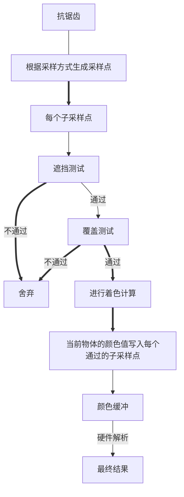

# 主流抗锯齿方案
> 这个只是一个总结的文章，涉及到的原理，现代图形API的特性，可以直接去引用的原文看
## 锯齿产生的原因
> 锯齿的来源是因为场景的定义在三维空间中是连续的，而最终显示的像素则是一个离散的二维数组。所以判断一个点到底没有被某个像素覆盖的时候单纯是一个“有”或者“没有"问题，丢失了连续性的信息，导致锯齿。从信号角度来说，就是采样的频率跟不上信号变化的频率。所以最有效的解决方法就是增加采样频率，实时渲染中的抗锯齿基本为先模糊再采样的操作     

光栅化的过程，如下图   
   
光栅化时，每个像素可以看做成一个小方格子，使用这个格子的中心来去做采样（判断在不在三角形内），光栅化采用的算法有扫描线算法，包围盒算法等。都不妨碍理解光栅化的过程。

以最简单的包围盒算法为例，渲染一个三角形时，计算出它的xy坐标的最大最小值，形成一个正方形，判断这个正方形内的每个像素是否在三角形内，如果在，便进行颜色计算。（对于正方形外的像素，其实是不用计算在不在三角形内的，所以对于SAA这类抗锯齿算法来讲，场景中物体越多，开销越大）

在光栅化中锯齿的原因产生如图  
  

# 解决方案
## SSAA（超级采样抗锯齿）  
  最有效的方案便是增加采样频率，即一个像素用多个采样点，每个采样点计算一次PS。如果我们的屏幕大小为800X400的，渲染时可以将图形渲染到1600X800上，然后再将图形缩小。缩小是每四个像素通过卷积变成一个。另外一种方法是，将图形渲染到四张相同大小的图上，然后每张图给一点偏移量后模糊。这两种方案的开销非常大，实时渲染中很少采用。
## 一 MSAA

MSAA脱胎于SSAA。但是区别是，一个像素的多个采样点只进行一个ps计算，然后把结果存在被覆盖的次采样点中。每个次采样点都会有一个对应的颜色缓冲，深度缓冲和模板缓冲。即，如果有四个采样点，颜色缓冲，深度缓冲和模板缓冲大小会增加四倍。

  
 
MSAA是一种全屏抗锯齿技术，即如果按照上诉描述的那样，需要对所有的像素进行次采样操作，开销依然很大。

### 1. 硬件做法

遮挡测试便是最直接的深度模板测试，每个子像素点都会进行一次。  
覆盖测试——只要有一个子采样点在三角形内，就会对这个像素进行PS计算。每个子采样点都有一个掩码，标记了其是否通过了覆盖测试，如果通过，则在ps输出阶段会将颜色值写入。  

ps阶段计算采样点的选择。有些时候，三角形会覆盖像素的中心采样点，有时不会。如果没有覆盖中心采样点但是PS阶段用中心去插值得到的结果就会出现问题。GPU硬件会使用**centroid sampling**来调整采样点的位置，当像素中心点未被三角形覆盖时，GPU会使用最近的通过覆盖测试的点作为采样点。


如下图所示
 

虽然MSAA多个子采样点只计算一次shading，但是当一个像素被多个物体覆盖时，MSAA的性能便会不稳定。如Camera或者物体的运行导致几何图元覆盖率不断变化时。下图展示了不同的情况下的子采样点的shading的次数
<div align=center> </div>

<center><font size = 1>4个子采样点中有三个被覆盖，执行两次shading计算</font></center>

<div align=center> </div>

<center><font size = 1>4个子采样点被同一Primitive覆盖，执行一次shading计算</font></center>

MSAA会使用单独的贴图格式来存储值。如RGBA8_4X，表示四个采样点的MSAA贴图，占用内存是普通贴图的4倍。

如上图左边所示，对于 MSAA，每个像素上的次像素点，都会单独存储颜色值。一种优化的方案是使用 NVIDIA 的 CSAA(coverage sampling antialiasing)或者 AMD 的 EQAA(enhanced quality antialiasing)。如上图右边所示，这种方式下每个次像素点不会记录颜色，而是记录颜色列表的索引，这样可以减少内存的消耗。


当所有的渲染工作都完成后，就可以对 MSAA 的 RenderTarget 进行 resolve 操作，来得到最终的结果。一般情况下，MSAA 是硬件直接用 box filter 进行 resolve，也就是将像素中对应的次像素点中的颜色直接取平均值。这样 filter 之后，就可以得到边缘平滑的抗锯齿效果，每个像素上的次像素采样点越多，得到的效果也就越好。
### 2. MSAA的采样模式
有效的采样模式也是 AA 很重要的部分，这点不仅包括 MSAA ，对于后面我们将要讲到的 TAA ，也是一样的道理。

一般来说，MSAA 不会直接在一个像素上进行网格状均匀放置次像素点。我们更加倾向于使用**低差异采样序列**，比如 Halton 序列，Poisson disk 等。比如下图所示，分别是2x，4x，6x，8x MSAA 的常用采样模式。 MSAA 通常会直接在在硬件中集成好采样模式，而不需要手动设置位置。
 

#### 3.MSAA Resolve
早期的Gpu Resolve是在固定硬件中执行的，操作基本上等同于对给定的像素内的所有子样本进行平均，好处是完全被覆盖的像素最终得到的颜色值与不进行MSAA一样。

现代的API提供了自定义的Resolve方式。

MSAA的深度缓冲和模板缓冲的大小也会翻倍，Resolve时并不会得倒准确的深度值，因为对四个子采样点进行平均得倒的深度是不对的，现代API如VK,DX12提供了自定义解析方式，如使用最大值，或者最小值作为该像素的深度值，但是Opengles并没有提供这个功能，所以在URP中，如果开启了MSAA且使用的API为Opengles，将会使用DepthPrepass，提前进行一次深度计算。

传统的API可以进行软Resolve，即将没有解析的多倍的缓冲图用作纹理，然后通过在shader中使用特定的函数实现。深度也可以通过这种方式进行软解析。解析方式如下
```C#
  uniformvsampler2DMS screentextureMS;    ///声明该贴图是为解析的多重采样图
  vec4 color = texelFetch(screentextureMS,Texcoords,3);//三表示采样第三个子采样点
```

离屏渲染时，什么时候解析多重渲染纹理，通过将多重采样缓冲拷贝到一个中间缓冲便可以实现。通过**glBiltFramebuffer** 来拷贝同时解析。


### 4.CSAA和EQAA
Nvidia和AMD有特殊的Resolve方式，并且可以在MSAA渲染目标中访问任意子样本数据。
### 5.On-Chip MSAA

移动设备上的 GPU，会使用 Tiled 模式的方式进行渲染。在 Tiled 模式下，屏幕会划分成 16x16的 tile，每个 tile 作为一个组进行渲染。在渲染每个 tile 时，FrameBuffer 会存储在 on-chip 缓存中，以便快速访问。当整个 tile 渲染完成后，on-chip 缓存中的 FrameBuffer 会写回到内存中，这样可以降低带宽的占用。

在这类设备上使用 MSAA 时，就可以在 MSAA 的 FrameBuffer 写回内存时，进行 Resolve 操作，这样可以节省内存和带宽。

在 UE4 中，在手机上开启 MobileMSAA 设置时，就可以直接使用这种 On-chip 的 MSAA方式。

在 Unity 中使用要更加复杂一些，Unity 没有自带 On-chip MSAA的设置，需要自己将 RenderTarget 设置为 Memoryless 模式，将物体渲染到 RenderTarget 上，而且只能支持 Vulkan 和 Metal图形平台。

### 6. MSAA的一些问题
#### 一 HDR
开启MSAA后，如果同时启用了HDR，颜色对比度高的地方会出现明显的锯齿。如下图所示:
<image src= "https://therealmjp.github.io/images/converted/msaa-overview/humus_normal.png">

产生锯齿的原因是对比度高的地方的值，在解析时，应用BOXResolve处理多个采样点取平均后的值会使对比度更高，不会很好的融合，产生了锯齿。

解决办法，如果可以自定义解析方式，则通过自定义解析来解决，如果不可以，则参考堡垒之夜在移动端的MSAA方案，主要是解决没有CustomResolve的时候解决HDR抗锯齿的问题

1. 首先是在Base Pass的最后一个dc绘制一个全屏的quad，里面的shader非常简单，就是一个alu拟合的tonemapping，使用了FrameBufferFetch特性，这个DC可以称之为PreTonemapMsaa，注意只在移动端iOS开启
2. 在TBDR的架构中Store 出来 的scene color直接就是抗锯齿的，在后处理阶段，由于还是需要HDR的渲染信息，所以在后处理之前还是会做一个反向的alu tonemapping来还原HDR信息，另外这个过程并没有用一个单独的pass来处理，而是合并在后处理的第一个pass中，节省了带宽。 默认状态下，这个计算放在了BloomSetup Pass中。

现在的图形API除了OpenglES以外都支持了CustomResolve。

#### 二  深度问题
MSAA开启后，深度附件也会成为多重采样附件，如果后续不需要深度图的话，没有什么问题。但是如果需要深度图，向OpenGlES  API又不支持Custom Resolve和解析深度的情况下，是不可以通过Copy   DepthAttachment来获取深度的，Unity通过一个PerDepthPass，来提前渲染一边所有写入深度的物体来获取深度图，这样的方法在移动端，不仅会使DC翻倍，也会使顶点数据翻倍。

针对OpenglES 的解析问题如下文。
- OpenglES 
  OpenglES 本身并不支持MSAA，实现MSAA的方式是通扩展。解析方式为检测到当前的贴图状态改变时，自动解析，即如果从一个写的状态变成读的状态，就会自动解析。但是这个扩展只对Color  attachment 可用，即不会自动解析Depth。

- 解决办法:
    1. **Shader Framebuffer Fetch**

> 注:深度问题会影响到深度测试和Early-Z，但是移动端有隐面剔除技术，并不特别依赖Early-Z。
#### 三 移动端可能造成的性能问题
1. MSAA采样数过大，因为移动端的MSAA在Tile上执行，如果采样数过多，就会造成一个Tile需要的空间变大，而总的On-Chip是有限的，GPU会通过增加分得的Tile数量来限制一个Tile的大小，这样原本是32X32的一个tile执行一次，可能会变成16X16，而移动端GPU一次执行一个Tile，Tile变多意味着执行的次数变多。同时一个三角形在多个Tile中会多次绘制。
2. 内存问题。在移动端做MSAA得益于Tile上执行，但是如果FB格式设置的不正确，会导致一个渲染缓冲区的内存翻倍（类似PC端，开启MSAA后一个FB的附件大小会翻倍）。如下图所示:
   <image src ="https://pic3.zhimg.com/80/v2-4a0b82ac49247fcbd4a0bce125fe6202_720w.jpg">
通过设置Store Action 不resolve MSAA RT，以及将内存模式设为memoryless可以达到内存和带宽的最优状态
  <image src = "https://pic4.zhimg.com/80/v2-482696bbb141c26267953c863e828657_720w.jpg">

> 另外需要特别注意的一点就是在一些android设备中，当framebuffer fetch存在的时候，msaa会退化成per sampler shading，消耗倍增，需要特别注意。**这段作者本人只给出了结论，没有给出验证，我不清楚实际情况。**

### 参考以下文章
1. [移动端高性能图形开发 - 详解MSAA](https://zhuanlan.zhihu.com/p/382063141)
2. [游戏引擎随笔 0x15：现代图形 API 的 MSAA](https://zhuanlan.zhihu.com/p/263101710)
3. [从一个小bug看MSAA depth resolve](http://aicdg.com/ue4-msaa-depth/)
4. [opengl es 3.0 MSAA depth resolve](http://aicdg.com/gles3-msaa-depth/)
5. [vulkan mass shader resolve](http://aicdg.com/vulkan-mass-shader-resolve/)
6. [[译]Bandwidth Efficient Graphics with ARM Mali GPUs](https://zhuanlan.zhihu.com/p/344809069)
7. [游戏引擎随笔 0x09：现代图形 API 实战回顾-Vulkan 篇](https://zhuanlan.zhihu.com/p/124251944)
8. [游戏引擎随笔 0x11：现代图形 API 特性的统一：Attachment Fetch](https://zhuanlan.zhihu.com/p/131392827)


